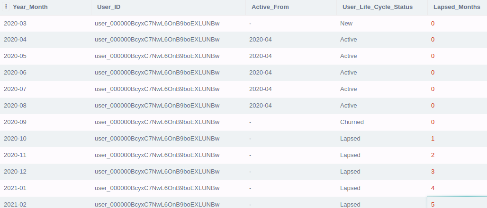

# User Life Cycle (Django Application)

Purpose of this application is to allow to check
the life cycle status of the user based upon different
queries as well as check policies assigned to any user.

### Dependencies
- Python 3+ (ideally 3.5)
- Pip

### Instruction to Setup
- Clone with command: `git clone https://github.com/hmafnan/UserLifeCycle.git`
- cd into UserLifeCycle(root of the project)
- Optional: If pip3 is not installed use this command: `sudo apt-get install python3-pip`
- Create virtual environment by using python 3 with command: `virtualenv -p python3 venv`
- Activate newly created virtual environment with: `source venv/bin/activate`
- Run: `pip install -r requirements.txt`
- And run dev server with: `python manage.py runserver 8004`

### Instruction to Run Unit tests
Unit tests are written with assumption that available data is static and should not be 
changed for now
- cd into root of the project
- To run tests `python manage.py test user_profile/tests/`
- All tests should run successfully

### Test Data
- Sqlite for django application is used
- Data models are mapped to available csv files
- Extra model `ViewUsersLifeCycleStatus` was also created which contains data generated by sql queries
of task 1, therefore to avoid writing same queries again.

### Open End points
When dev server is running(at localhost port:8004) following end points can be accessed from browser
which should return json data.    
... Assumption made: For some end points(eg: New user by date) optional params(month) was not passed because 
it is already taking date as required argument.

1. All Policies: `http://localhost:8004/api/policies/`
    - With optional params: `http://localhost:8004/api/policies/?month=4&underwriter=blue` 
2. Policy count by user: `http://localhost:8004/api/policy_count/?user_id=user_000000BcyxC7NwL6OnB9boEXLUNBw`
    - With optional params: `http://localhost:8004/api/policy_count/?month=4&underwriter=blue&user_id=user_000000BcyxC7NwL6OnB9boEXLUNBw`
3. Days active by user: `http://localhost:8004/api/days_active/?user_id=user_000000BcyxC7NwL6OnB9boEXLUNBw`
    - With optional params: `http://localhost:8004/api/days_active/?user_id=user_000000BcyxC7NwL6OnB9boEXLUNBw` 
4. New user by date: `http://localhost:8004/api/new_users/?date=2020-03-29`
    - With optional params: `http://localhost:8004/api/new_users/?date=2020-03-29&underwriter=blue`
5. Lapsed user by month: `http://localhost:8004/api/lapsed_users/?month=10`
    - With optional params: `http://localhost:8004/api/lapsed_users/?month=4&underwriter=blue`
6. New user premium per date by underwriter: `http://localhost:8004/api/new_users_premium/?underwriter=blue`
    - With optional params: `http://localhost:8004/api/new_users_premium/?month=3&underwriter=blue`
    
# SQL Queries
Queries are written and tested for two versions of database(Sqlite and MySQL) which can be found inside
`sql/sqlite_query.sql` and `sql/mysql_query.sql`.
Some assumptions are also made  for queries because some concepts and business logic were not quite clear by 
looking at available data and description.

### Assumptions made by understanding problem:
- First month of policy means user is `new`
- Remaining month of policies means user is `active`
- First month after no policy is found means user is not active that is `churned`
- Remaining months after churned means `lapsed`
- Rolling months sum is only calculated during the `lapsed` period, and for remaining periods its 0
- 'Active From' is only calculated during `active` period, and for remaining periods its blank

Following snapshot from actual result of the query is shown:

